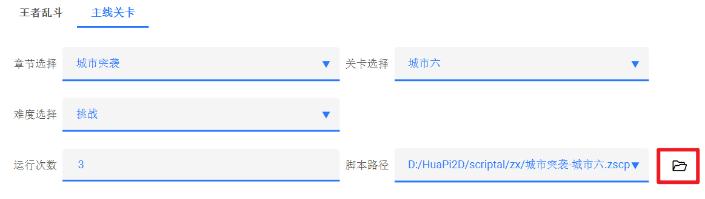

# 画皮`2D`

---

## 写在前面

在学习 `Qt` 图形编程，并尝试自己做出第一个图形界面程序后，创作的热情就难以消减，一切都是因游戏脚本而燃起热情，但热情不会止步于游戏脚本的制作。对于大学上学习的课程内容，以及任何可以想到的小玩意，我都有将那些东西全部写进这个项目的冲动。这一切可能会耗费我不止大学的几年时间，但趁时间尚早，人还年轻，无论对错，尽管尝试。

## 一、模块功能

### 1.1 生死狙击

本模块集成了识图 ，键盘鼠标模拟，进程控制等游戏脚本常见功能。实现了全自动挂机、生死狙击武器加成辅助功能，方便的脚本录制和编写功能，你只需要专注助于完成游戏内的脚本逻辑，剩下的工作脚本将帮助您完成。

#### 1.1.1 全自动脚本挂机

##### **界面展示：**

- 王者乱斗

- 主线关卡

##### **单次运行结果展示：**

##### 使用技巧：

> 在添加脚本任务的过程中，只需要注意**不要把使用不同武器的脚本放在同一任务列表**里即可
>
> 为了减轻用户添加脚本任务时的工作量，提供了任务列表导出及导入功能
>
>  

> 当你从各种途径获取到别人录制的脚本后，**最好**将其放在软件的安转目录下的指定位置：
>
>  
>
> 这样在启动软件后，就会自动将脚本读取至本地数据库，**当然**你也可以在添加任务时选择相应文件：
>
>  
>
> **又或者**批量从其他文件夹的位置将文件路径读入数据库：
>
>  

#### 1.1.2 虚拟机测试脚本

开启过程：

- 连接虚拟机

	 

- 修改分辨率为100

- 立即注销

	 

- 进入桌面

- 增强会话

#### 1.1.3 辅助加成

**界面展示：**

使用情景：

- 角斗场：角斗场每一关使用的武器配置都可以进行保存，方便下次直接进行选择。

优势：

- 在最短时间内，根据顺序开启加成，达到短时间的爆发输出

#### 1.1.4 脚本录制及编写

- 从 `v1.1.1` 开始支持主线关卡的脚本录制功能，支持乱斗和普通脚本的编写功能，详细的录制教程可以参考软件内的提示。

	 

	- 设置游戏内的鼠标灵敏度为40，确保按下两次→或←后，人物正好转动90

		 

	 

### 1.2 音乐盒

本模块主要收集的是网络音乐网站的内容，目前提供了基础的歌曲搜索、歌曲播放器、歌曲下载功能。

#### 1.2.1 搜索页

**界面展示：**

音乐源：

- 歌曲宝

**部分歌曲的下载存在问题**

#### 1.2.2 本地页

**界面展示：**

### 1.3 墨韵声扬

本模块主要接入了阿里云语音模型，提供了一些文字转语音的功能。

**界面展示：**

语音场景：

 

语音音色：

 

## 二、其他功能

### 2.1 主题风格切换

软件应用了开源项目 https://github.com/githubuser0xFFFF/Qt-Advanced-Stylesheets 进行界面主题风格的构建，分为暗色和亮色两大主题。也提供了自定义 `.qss` 风格文件导入的功能，可以切换界面到 `MacOs` 或 `Ubuntu` 等操作系统的界面风格。

**亮蓝色系风格：**

**暗黄色系风格：**

**`Ubuntu` 界面：**

### 2.2 多语言

> 利用 `Qt` 提供的翻译模块实现了对于界面大部分内容的批量机翻工作，主要处理利用的是 `lupdate` 生成的 `.ts` 文件以及 `Qt Linguist` 生成的 `.qm` 文件。
>
>  由于利用 `Qt Linguist` 手动翻译的工作量巨大，因此采用 `Python` 脚本进行了批量的处理工作，具体可以参考项目： https://github.com/HuaPi2d/QT-Liguist-Promax 
>
> 
